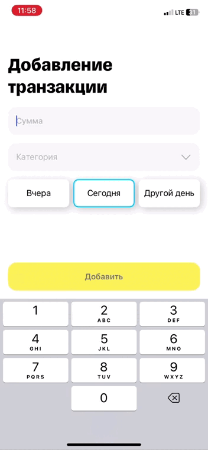

# MoneyMind - iOS Finance Management App

MoneyMind is a modern iOS application designed to help users manage their personal finances effectively. The app provides a comprehensive set of tools for tracking expenses, managing budgets, and gaining insights into spending patterns.

## 🚀 Features

- Personal finance tracking and management
- Budget planning and monitoring
- Expense categorization
- Financial analytics and insights
- Modern and intuitive user interface
- Secure data storage

 ## Screencast

 ### Authorization process 


 ### Setup budget distribution 


 ### Adding new transaction


 ### Checking your expences


 ### Adding a new goal or editing an old one


 ### Сhange theme and language


## 🛠 Technical Stack

- **Language**: Swift
- **Minimum iOS Version**: iOS 15.6+
- **Architecture**: MVVM + Coordinator Pattern
- **Key Components**:
  - UIKit
  - Combine framework for reactive programming
  - Core Data for local data persistence
  - Dependency Injection for better testability
  - SwiftLint for code style enforcement

## 📚 Used Libraries

### Core Libraries
- **Alamofire** - Elegant HTTP Networking in Swift
  - Used for all network requests and API communication
  - Provides robust error handling and request/response serialization

- **Swinject** - Dependency injection framework
  - Manages dependencies between components
  - Provides clean architecture and testability
  - Used in DIContainer for service registration and resolution

- **Combine** - Apple's framework for reactive programming
  - Used for data binding and reactive UI updates
  - Handles asynchronous events and data streams
  - Manages state updates across the app

### UI Libraries
- **SnapKit** - DSL for Auto Layout
  - Used for programmatic UI layout
  - Provides clean and readable constraint syntax
  - Makes complex layouts easier to maintain

- **SkeletonView** - Elegant loading animation
  - Used for loading states in lists and cells
  - Provides smooth loading animations
  - Improves user experience during data fetching

### Utilities
- **PhoneNumberKit** - Phone number formatting and validation
  - Used in phone number input screens
  - Provides proper formatting and validation
  - Supports international phone number formats

### Apple Frameworks
- **UIKit** - Core UI framework
  - Used for building the user interface
  - Provides fundamental UI components
    
- **UserNotifications** - Push notifications framework
  - Handles local and remote notifications
  - Manages notification permissions and delivery

### Development Tools
- **SwiftLint** - Code style enforcement
  - Ensures consistent code style
  - Configuration in `.swiftlint.yml`

## 🔐 Backend Integration & Authentication

### API Integration
The app communicates with a RESTful backend API (`https://t-bank-finance.ru`) using the following services:

- **AuthService**: Handles user authentication
  - SMS-based authentication flow
  - Phone number verification
  - JWT token management

- **ExpencesService**: Manages financial transactions
  - Fetch expenses with filtering and pagination
  - Add/delete transactions
  - Category management
  - Budget balance tracking

- **GoalsService**: Handles financial goals
  - Create and manage savings goals
  - Track goal progress
  - Goal distribution management

- **BudgetService**: Manages budget planning
  - Set monthly budgets
  - Configure budget distributions
  - Track budget limits and notifications

### JWT Authentication
The app implements a secure JWT-based authentication system:

1. **Token Management**
   - Secure storage of access and refresh tokens in Keychain
   - Automatic token refresh mechanism
   - Token expiration handling

2. **Security Features**
   - Tokens are stored securely using KeychainManager
   - Automatic token refresh on 401 responses
   - Secure token transmission using Bearer authentication
   - Token invalidation on logout

3. **Authentication Flow**
   - Initial authentication via SMS verification
   - JWT token pair (access + refresh) management
   - Automatic token refresh when access token expires
   - Secure session management

4. **Error Handling**
   - Proper handling of authentication errors
   - Automatic logout on refresh token expiration
   - Network error handling with retry mechanism

### Network Layer
The app uses a robust network layer built with:

- **Alamofire** for HTTP networking
- **Combine** for reactive programming
- Custom request/response interceptors
- Automatic retry mechanism for failed requests
- Proper error handling and response validation

## 📱 Project Structure

```
MoneyMind/
├── AppCoordinator.swift      # Main application coordinator
├── TabBarCoordinator.swift   # Tab bar navigation coordinator
├── Screens/                  # Main app screens
├── Models/                   # Data models
├── Services/                 # Business logic and services
├── Managers/                 # App managers and utilities
├── CustomViews/             # Reusable UI components
├── Resources/               # Assets and resources
├── Helpers/                 # Utility functions
└── DIContainer/             # Dependency injection setup
```

## 🏗 Architecture

The app follows modern iOS development practices with a combination of MVVM and Coordinator patterns:

- **MVVM (Model-View-ViewModel)**: Separates business logic from UI
- **Coordinator Pattern**: Handles navigation flow
- **Dependency Injection**: For better testability and modularity
- **Combine**: For reactive programming and data binding

## 📝 Code Style

The project uses SwiftLint for code style enforcement. Configuration can be found in `.swiftlint.yml`.


## 📄 License

This project is licensed under the MIT License - see the LICENSE file for details.

## 👥 Authors

- Sushkov Pavel - Initial work
